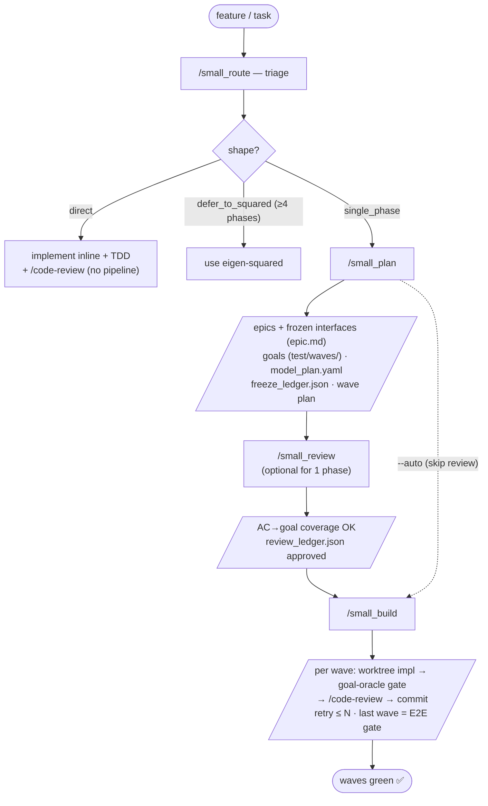
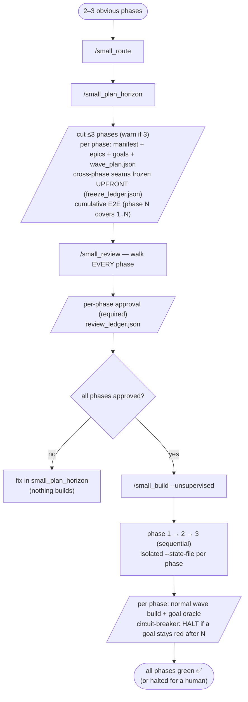

# eigen-small

A **router-driven, artifact-robust, goal-gated** pipeline for small/medium work —
a feature or a single-phase product (roughly ≤ ~1,500–2,000 net-new LOC, often on
an existing codebase) where the full `eigen-squared` apparatus is over-scaled and
`eigen-lite`'s swarm-worker execution is not the model you want.

Full design: [`../../docs/eigen_small_design.md`](../../docs/eigen_small_design.md).

## What it is (and isn't)

| | scope | execution model | router? | artifact-robust? |
|---|---|---|---|---|
| `eigen-squared` | 10–150+ features, multi-phase | swarm TDD-A/B workers + 8-agent review + watchdog | no | no (strict ordering gate) |
| `eigen-lite` | 2–5 features, single-phase | still the squared TDD-A/B swarm workers | no | partial (skip-if-output-exists) |
| **`eigen-small`** | a feature / single-phase product | **direct build per epic + goal-as-stop-condition + lightweight review** | **yes** | **yes (reuse / synthesize / skip)** |

eigen-small's three genuinely-new contributions over the siblings: (1) a **router/triage**
front-end that sizes the work and prunes/synthesizes stages; (2) **artifact-robustness** —
run a stage even when its upstream was skipped, by synthesizing the minimal viable
artifact; (3) **goal-gate direct-build** — each epic is built straight from its
`epic.md`, gated by an executable real-boundary goal as its stop-condition, instead
of the swarm-worker decomposition.

## Commands

```
small_start   ONE-TIME setup: install the eigen-small CLI wrapper on PATH (manual-only; --reinstall-cli-only)
small_route   triage → shape + two dials → drives planning in-session → stops at the plan→build boundary
small_plan    collapsed planning: manifest → bootstrap-delta → space_split + goals (reuse / synthesize / skip)
small_plan_horizon  long-horizon planner: cut up to 3 phases (warn >2), reuse small_plan per phase, freeze cross-phase seams upfront, cumulative E2E
small_review  interactive comprehension + validation gate: synthesize specs+goals per phase, mechanical AC→goal coverage, record per-phase approval
small_build   wave executor: per-epic implementers (worktrees) → goal-gate stop-condition → per-wave review
```

## Usage — which flow for which task

`small_route` triages every job and picks a **shape**; the shape decides the flow:

| Your task | Shape | Flow |
|---|---|---|
| Trivial / one cohesive change (≲ ~200 LOC) | `direct` | Implement inline + TDD + `/code-review`. **No pipeline.** |
| A feature / small product, one obvious phase | `single_phase` | **Flow A** (below) — the main path |
| 2–3 obvious phases you want built unattended | `single_phase` (multi-phase) | **Flow B** (below) |
| Many features / non-obvious boundaries / **≥4 phases** | `defer_to_squared` | Use **eigen-squared** |

### Flow A — small feature / single phase (the main path)

| # | Command | What it outputs |
|---|---|---|
| 1 | `/small_route` | shape + dials in `pipeline_state_small.json` + a rationale paragraph; **stops at plan→build** (or `--auto` continues) |
| 2 | `/small_plan` | epics (`epic_manifest.json`, `epic_<M>/epic.md` with **frozen interfaces**), goal specs under `test/waves/<id>/`, `phase_e2e_config.json`, `model_plan.yaml`, `freeze_ledger.json`, the wave plan; **stops at plan→build** |
| 3 *(optional)* | `/small_review` | synthesized walkthrough + **mechanical AC→goal coverage**; approval in `review_ledger.json` |
| 4 | `/small_build` | per wave: implement each epic in a git worktree → orchestrator runs the **frozen goal as the oracle** → `/code-review` → commit; bounded retry (`--max-attempts N`); last wave = the E2E gate |



### Flow B — larger / multi-phase (2–3 phases, unattended)

Use this **only when the work is predictable enough to plan all phases upfront** — it trades away
the "build phase 1, *learn*, then plan phase 2" loop for unattended throughput. The human validates
**every** phase in `small_review` *before* any build; then the builds run sequentially and
unattended, halting on the first goal that can't be met.

| # | Command | What it outputs |
|---|---|---|
| 1 | `/small_route` | recognizes 2–3 obvious phases (shape stays `single_phase`) |
| 2 | `/small_plan_horizon` | cuts ≤3 phases (**warns if 3**), plans each (reusing `small_plan`), freezes cross-phase seams **upfront** (`freeze_ledger.json`), cumulative E2E per phase, a `wave_plan.json` per phase |
| 3 | `/small_review` | walks **every** phase; per-phase approval in `review_ledger.json` — **required** to unlock step 4 |
| 4 | `/small_build --unsupervised` | gated on all phases approved → builds phase 1→2→3 sequentially (isolated `--state-file` per phase); **halts and surfaces** if any goal stays red after `--max-attempts N` |



> **≥4 phases → use eigen-squared.** Auto-advancing phases without a human between them is exactly
> what eigen-small avoids (and what squared has, hardened). Full rationale:
> [`../../docs/eigen-small-autonomy-analysis.md`](../../docs/eigen-small-autonomy-analysis.md).

## State CLI (thin, permissive)

A thin CLI over `eigen-core`'s atomic raw I/O. **Permissive** — `next` reports the
next actionable step and never refuses a skipped or reordered stage (the opposite of
squared's hard ordering gate). State lives at
`eigen_initiative/phases/pipeline_state_small.json`.

```
small init --initiative <name> [--phase N] [--shape ...] [--structure ...] [--rigor ...]
small set-shape --shape single_phase --structure epics_parallel --rigor high
small status
small next                                  # permissive: next stage/wave or "done"
small set-stage manifest --status synthesized [--path ...]
small set-waves --waves '[{"id":"a","epics":["E3","E4","E5"],"parallel":true}, ...]'
small complete-epic a E4 --goal-green
small record-goal-attempt a E4 [--reset]    # persisted goal-retry counter (circuit-breaker; survives resume)
small set-wave-review a --status done
small validate
small commit-state --message "..."
small freeze-add --phase 1 --name <seam> --kind frozen|hook [--signature ...] [--consumers ...]
small freeze-list [--phase N] [--kind frozen|hook]    # the cross-phase contract a later phase must respect
small set-review --phase N --status approved [--note ...]   # written by small_review (per-phase human approval)
small review-list [--phase N]                         # per-phase approvals; gates small_build --unsupervised
```

**Cross-phase freeze ledger** (`eigen_initiative/phases/freeze_ledger.json`): `small_plan`
records each phase's **frozen** seams (immutable contracts) and **hooks** (extension seams
left for a later phase). A phase-N run reads `freeze-list --phase <N-1>`, treats those as
read-only, and flags any design that would mutate one — this is the cross-phase verification
that makes the two-runs multi-phase approach safe.

Deliberately absent (the squared ceremony shed): the strict ordering gate, the
recommendation matrix, findings/signature validation, the scheduler/watchdog, and
the `gh`-probe guards.

## Architecture notes

- **Reuses `eigen-core`** (vendored into `_vendored/eigen_core/` by
  `tools/vendor-core.sh`): atomic state I/O + base models. A CLI is *required*, not
  optional — a markdown command can only get atomic writes by shelling out to a
  Python entry point.
- **Self-contained — no plugin dependencies.** Bundles its own read-only skills
  (`language-profiles` for toolchain detection, `security-best-practices` for secure-by-default
  coding/review, `goal-authoring` for the independent-real-boundary-oracle doctrine) and review
  agents (`data-integrity-guardian`, `security-sentinel`, `architecture-strategist`, mapped from
  epic `risk` tags). The `language-profiles`/`security-best-practices`/review agents were vendored
  from eigen-squared so eigen-small stands alone.
- **Live, per-run model tiering** (`phases/phase_<N>/model_plan.yaml`): `small_plan` emits it
  pre-filled with the default tiering (strongest model → goal authoring + riskiest/integration
  epics; cheaper → mechanical epics); the human tunes it at the plan→build STOP and `small_build`
  reads it before spawning each implementer (fallback to defaults if absent). It lives under
  `EIGEN_ROOT`, **not** in the plugin — so tuning a run never needs a reinstall.
- **Own flat state** (`pipeline_state_small.json`) with a `SquaredSchemaDetected`
  guard so it can never clobber a squared/lite state file.

## Multi-phase (2–3 phases): two paths

A 2-phase product (MVP → extensions) has two supported approaches:

1. **Two manual runs (conservative default).** Do phase 1, then run again with `init --phase 2`.
   The phase-2 run slots its artifacts into `phases/phase_2/`, **reuses** the existing
   `phase_2_manifest.md`, and builds on phase 1's **frozen extension seams** (no-op hooks). This
   preserves the "build phase 1, *learn*, then plan phase 2" loop. Best for exploratory work.
2. **Plan upfront + unattended build** (`small_plan_horizon` → `small_review` → `small_build
   --unsupervised`). Plan **2–3 phases at once**, freezing cross-phase seams upfront; a human
   validates every phase's specs+goals in `small_review`; then the builds run **sequentially and
   unattended**, halting if a goal can't be met after N attempts. Best for predictable work — it
   trades the learn-between-phases loop for unattended throughput.

**2 phases recommended; 3 is experimental (warned); ≥4 phases → use eigen-squared** (the router
answers `defer_to_squared`). See [`../../docs/eigen-small-autonomy-analysis.md`](../../docs/eigen-small-autonomy-analysis.md)
for the full Fork A rationale.

## Status

v1 complete: scaffold + thin CLI + `small_start` (CLI install) + the three pipeline
commands (`small_route` · `small_plan` · `small_build`). Registered in `marketplace.json`
(v0.4.0). Validated end-to-end via a `kvstore` dry-run. Supports a phase slot
(`init --phase N`) so a single run can layer as phase 2 onto an existing repo, plus the
§15 lean-philosophy refinements: a **cross-phase freeze ledger** (`freeze-add`/`freeze-list`),
a **one-pass cross-cutting critique** in `small_plan`, and **epic `risk` tags** driving
targeted review. As of v0.4.0: **self-contained** (no eigen-squared dependency — review agents
and reference skills vendored), a **`goal-authoring` doctrine skill**, and **live per-run model
tiering** (`model_plan.yaml`).
**Install with `/small_start`** (manual-only — no watchdog/env). Remaining hardening:
exercise the parallel-worktree fan-out and the manifest *reuse* path on a real project.
